# Genriflow

## Description
`genriflow` is a ML-based program to classify songs into genres. 

It includes the following files:
- `genrize.ipynb`: The CNN supervised model
- `genrize_lstm.ipynb`: The LSTM+CNN supervised model
- `genrize_unsupervised.ipynb`: The PCA+GMM unsupervised model
- `genrize_lstm_autoencoder.ipynb`: The LSTM autoencoder unsupervised model
- `preprocessing.py`: Feature extraction and standardization
- `features.ipynb`: Plots the features (MFCCs, spectrograms etc.)
- `figures_genriflow`: All the figures used for this README
- `models`: All the trained models

## Computational power: 

I used T4 GPU and High-RAM from google colab for training my model. I used CPU for feature extraction.

## Installation: 

I used standard python packages. The only ``unconventional ones'' are:
- librosa
- soundfile
- audiomentations: for the data augmentation of audio files

-----------------------
-----------------------
-----------------------
-----------------------
-----------------------

## Problem Statement

Classifying music files into genres is a challenging task—even for humans. Music resists rigid categorization: genre labels often remain static while music continuously evolves, and many genres share overlapping features. In this sense, genre classification is more cultural than strictly musical. Numerous artists, from FKA twigs and Taylor Swift to Bonobo and Herbie Hancock, have questioned the validity of genre labels and the cultural frameworks that underpin them. Meanwhile, certain genres such as ``global'' have been accused of post-colonization remnants and cultural biases.

Despite this, genre-based classification has historically played a significant role in how music is organized and understood.

The goal of this project is to develop a music genre classification model capable of handling large-scale datasets and generalizing to previously unseen songs. Here, I adopt an audio-based approach, extracting features directly from the audio signal rather than relying on precomputed tabular audio features.

## Background

As I transition from physics to machine learning, it’s time to get my hands dirty—working with real-world data and applying the theory I’ve studied to a practical problem. Audio signals and music theory are deeply rooted in physics, making them an ideal domain for me to explore hands-on machine learning.

On a personal note, as a passionate music enthusiast, I’ve curated a private music collection of over 3,500 songs, which I’ve manually (!) classified into three categories. Now feels like the perfect moment to build my own Spotify-like classification system, starting with a basic genre-based model. I still remember being fascinated at age 15 by my Sony Walkman MP3 player and its SensMe detection system, which categorized music by mood. Although that feature was eventually removed from later models, who knows—maybe one day I’ll have the time (and the tools) to recreate and expand on it myself. Yet, SensMe used similar feature-extraction that I am going to use for genre-based classification.

<figure align="center">
  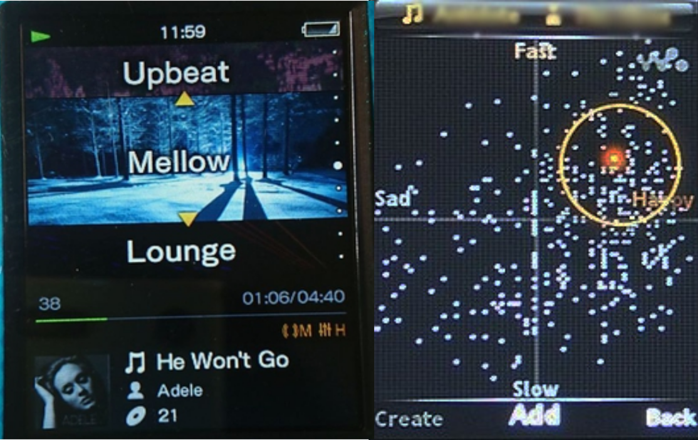
  <figcaption>SensMe in the Sony Walkman MP3 player [figs. from wikipedia]</figcaption>
</figure>

## Datasets

In this project, I use the standard GTZAN dataset, which classifies songs into 10 genres: blues, classical, country, disco, hiphop, jazz, metal, pop, reggae, and rock. More information and the dataset itself can be found on [Kaggle](https://www.kaggle.com/datasets/andradaolteanu/gtzan-dataset-music-genre-classification).

While these may not be the exact genres I ultimately want to cluster, GTZAN remains the go-to benchmark dataset for music genre classification.

In future iterations, I plan to apply the model to more flexible and diverse datasets, such as the [FMA dataset](https://github.com/mdeff/fma) or data obtained through the [Spotify Web API](https://developer.spotify.com/documentation/web-api).

## Audio Data Classification Models

An MP3 file contains an audio signal. A musical genre is a category that groups music based on style, form, or cultural origin. But how are these two concepts connected? The answer lies somewhere between music theory and signal processing. Here I will use 4 features: the _Chroma feature_, the _Tonnetz_, the _Mel Spectrogram_ and the _Mel-frequency cepstrum_.

The idea is to choose features to capture: the timbre, the pitch, and the intensity.

The pitch is how high or low a note sounds. The intensity is how strong or loud it sounds. The timbre is what makes instruments sound different even if they play the same note (pitch). 

### mp3

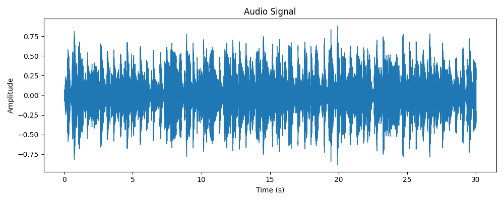

The first question I asked myself was: could I use the digital audio signal directly from an MP3 file? Well, not really. An audio signal contains a huge amount of unprocessed information. Meanwhile, the concept of a musical genre is complicated and hard to define. It depends on many different features, as I’ll explain later. To make the inference algorithm focus on specific aspects of the raw data and their correlations, further feature extraction is necessary.

### _Chroma_

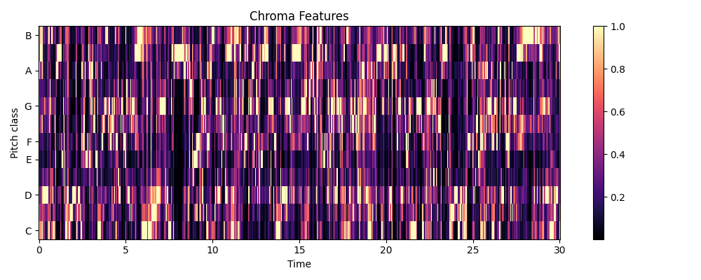

Chroma or chromagram maps an audio to 12 pitch classes (C, C♯, D, D♯, E, F, F♯, G, G♯, A, A♯, B). The idea lies on the observation that humans recognize two pitches similar when they differ by an integer number of octaves (e.g., C−2, C−1, C0, C1, C2 sound similarly). These classes come from the Western music while other cultures have different systems (e.g., Arabic maqam, Indian raga). Considering that most songs I consider are in the western scales, here I use these classes.

In simple terms, chroma captures the scale, the key, the notes.

### _Tonnetz_

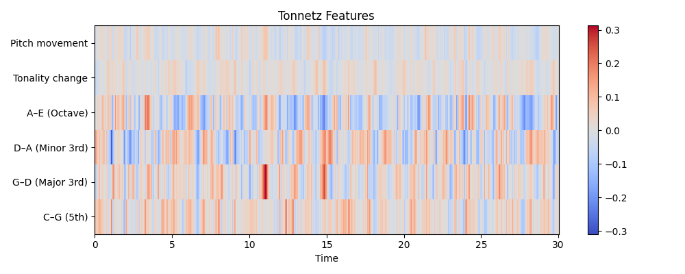

This concept was invented by the famous mathematician Euler and it shows the harmonic intervals such as the major and minor fifths, thirds, octaves, of the pitches based on the chromagram. 

In simple terms, tonnetz captures the chord progressions and the harmonics.

### _Mel Spectrogram_

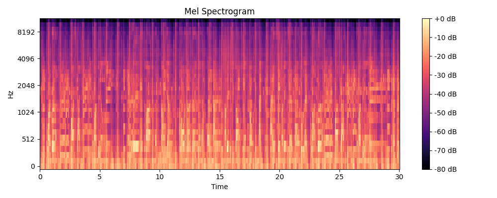

The mel-frequency cepstrum or mel spectrogram is a special type of spectrogram. The idea is to map the spectrogram (the frequencies) onto the mel scale (the mels). Human ears do not perceive pitches linearly. Distance between frequencies sound uneven. Mel scale is a proper stretch so that two tones with same mel distance sound equally spaced to our ears. 

In simple terms, the mel spectrogram captures the texture, the intensity patterns and the rhythm of the songs.

### _Mel-Frequency Cepstral Coefficients (MFCCs)_

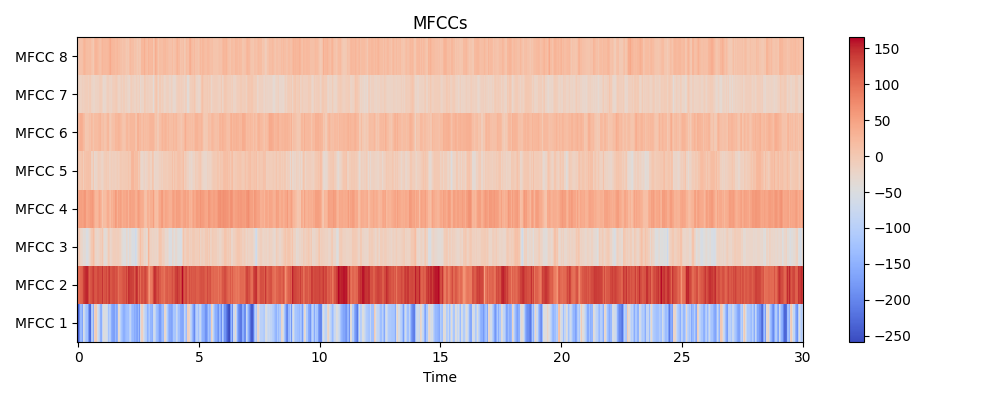

MFCCs were originally developed for speech recognition. They represent a compressed form of the mel spectrogram, a highly detailed representation, and are designed to capture important features for local description. In our approach, I use both representations: the mel spectrogram provides rich global information, while the MFCCs efficiently capture local spectral details relevant to human auditory perception.

In simple terms, the MFCCs characterize the timbre, i.e., the different instruments.

## Preprocessing

I used the _librosa_ library to extract the features mentioned earlier. First, I applied the librosa.load function to input the song and retrieve its audio data along with the sample rate. Next, I performed padding and trimming on the audio files to ensure they all have the same length (approximately 30 seconds). After that, I used librosa to extract the four features. The final step involved standardization, which took some time to fine-tune. The feature array for each main feature has the shape (samples, number of features, time length). Through experimentation, I found that the best normalization method was to normalize across all samples and time steps. Specifically, I reshaped the array to (samples * time, features) and then applied normalization on a per-feature basis. In other words, for each feature column (e.g., MFCC1, MFCC2, etc.), I subtracted the mean and divided by the standard deviation.

## Modelling Attempts

My initial approach was to apply unsupervised learning without using any labels, aiming to discover clustering patterns that might correspond to musical genres. I began with __PCA__ and __Gaussian Mixture Models__ (similar to k-means), and later explored __autoencoders__. However, this approach proved to be a disaster, prompting me to switch to supervised learning. I ambitiously attempted to use __RNNs (LSTMs)__, before eventually returning to __CNNs__, where I achieved a respectable accuracy score. I then experimented with __data augmentation__ to improve the model, but the performance increase was minimal compared to the significant additional computational resources required.

### Unsupervised PCA + GMMs (4 Clusters)

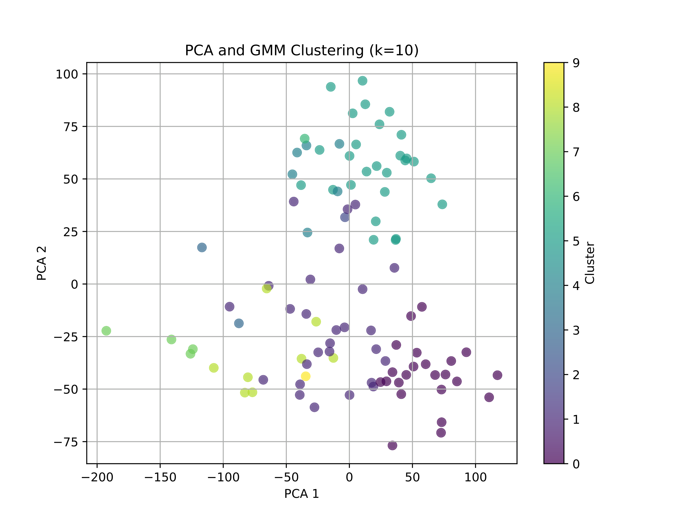

I used the processed data and flattened the time dimension, resulting in arrays of shape (samples, features * time_steps). Then, I applied PCA to reduce the dimensionality and used a Gaussian Mixture Model (GMM) for clustering with 10 genres.

To evaluate the accuracy, I used the Adjusted Rand Index (ARI) and Normalized Mutual Information (NMI). The challenge arises because, while we have true labels, the predicted labels are simply cluster indices. We don't know which index corresponds to which cluster.

NMI measures how much knowing the cluster reduces the uncertainty about the true label, while ARI assesses the similarity between two clusterings (the true clustering and the predicted clustering in our case).

For both metrics, a perfect match yields a value of 1, while random labels correspond to 0.

In our case, we obtained ARI = 0.1283 and NMI = 0.2958, which is disappointing. The issue likely stems from the flattening step, which overlooks temporal correlations. This led me to explore using supervised learning instead.

### LSTM - Autoencoders (Unsupervised)

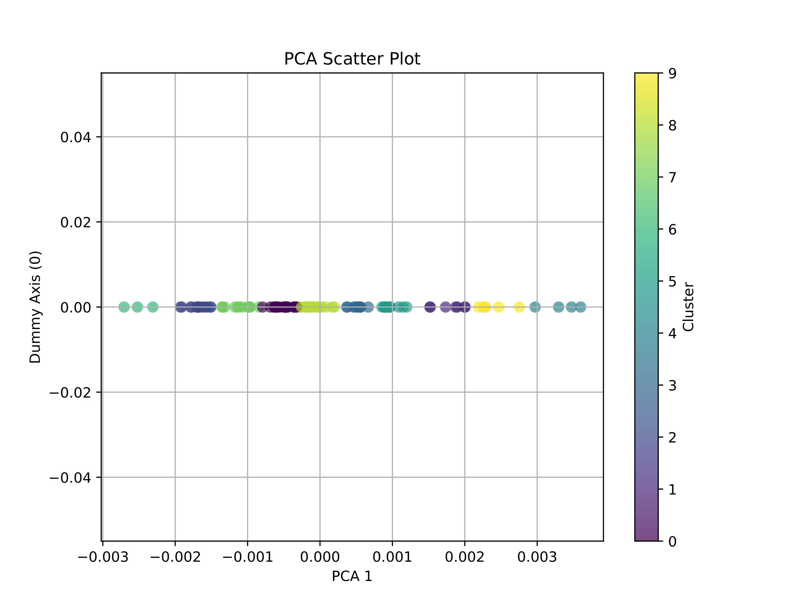

In order to take into consideration the temporal correlations, I used an LSTM - autoencoder. The idea is to use an autoencoder with LSTM layers and then take the latent representation and apply PCA+kmeans. The result: a disaster: ARI = -0.0081 (worse than random!), NMI=0.202. This led me to explore using supervised learning instead.

### LSTM

We have long time-series data here, which clearly calls for 'LSTMs'. I initially experimented with LSTMs, trying 1, 2, and even 3 layers. However, I encountered an issue: all my predicted labels were class 0. This reminded me of my past experience with Hopfield Networks, where more patterns are stored than the network's storage capacity allows. Of course, this is just a resemblance—I don't know the VC dimension of LSTMs.

Afterward, I tried combining LSTMs with CNNs. The idea was to take the hidden state of the LSTMs, feed it into a CNN, and then apply max pooling to transform the shape from (batch_size, cnn_out_channels, sequence_length) to (batch_size, cnn_out_channels). Following that, I used two fully connected layers to perform the classification.

After training, my test accuracy reached 56.5%, which I consider pretty decent!

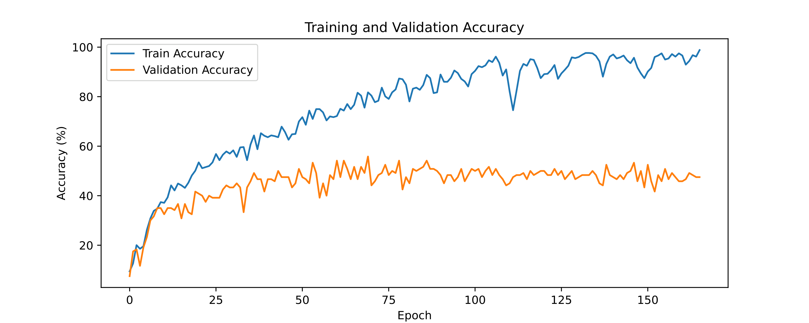

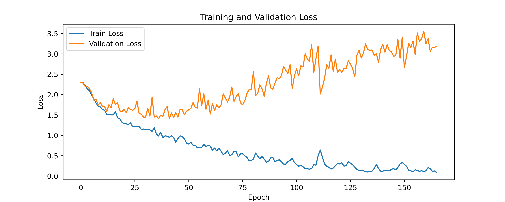

### CNNs

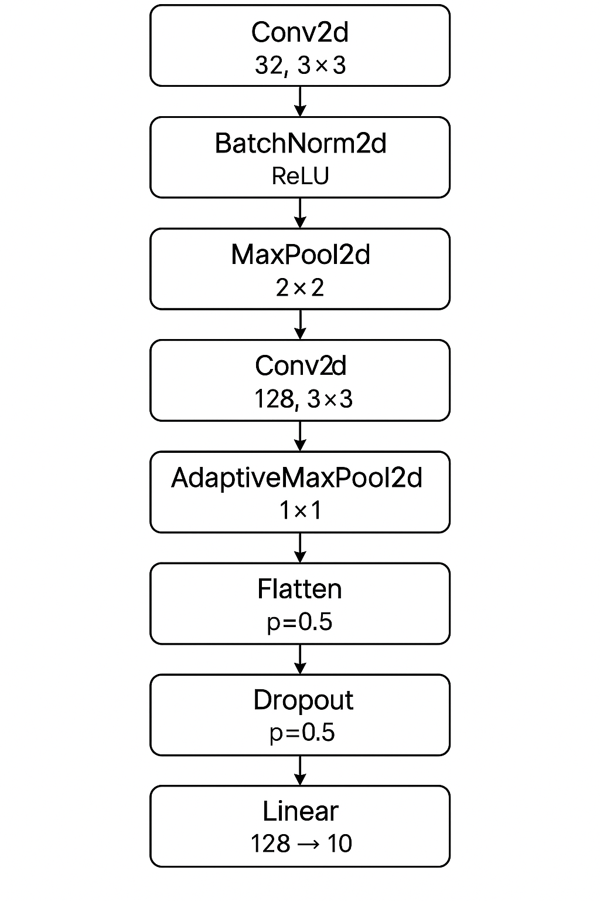

The architecture with which I achieved the highest accuracy is a CNN with one layer of a fully connected network. The neural network is shown in the figure. Without regularization, the test accuracy is 66%. With regularization, I achieved 74%. Then I tried data augmentation with both strong and weak augmented data. The weak augmentation consists of just Gaussian noise, while the strong augmentation includes additional time-stretch, shift, and pitch shift. I found that the strong augmented data actually hurt the test accuracy, whereas the weak augmented data did not improve the accuracy considerably (I got 74.5%).

Plots of the training and validation error and loss for augmented and non-augmented case are shown below.

<figure align="center">
  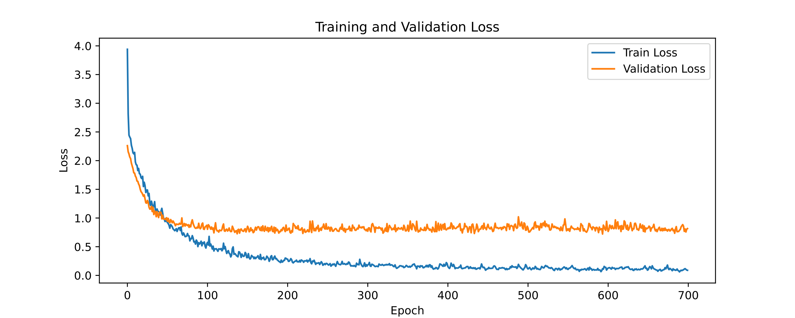
  <figcaption>Loss for regularized CNN without augmentation</figcaption>
</figure>

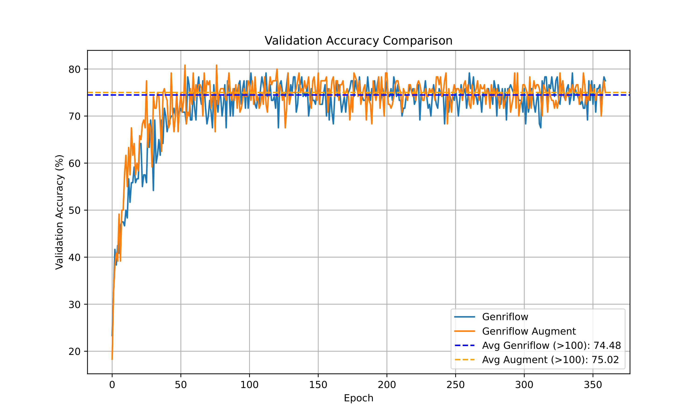

## Model Conclusions

In this notebook, I attempted to classify songs into genres using the following four features:
1. Chroma
2. Tonnetz
3. Mel spectrogram
4. Mel-Frequency Cepstral Coefficients

After preprocessing the data, I trained the following five models:

1. Unsupervised:
  - PCA + GMMs
  - LSTM Autoencoders
2. Supervised:
  - LSTM + CNN
  - CNNs with regularization
  - CNNs with regularization and augmented data

The unsupervised approach was the least promising, as it achieved low Adjusted Rand Index and Normalized Mutual Information scores—metrics used to test the accuracy of the clustering against the given labels.
The supervised approach, however, achieved test accuracies above 50% (LSTM + CNN: 56.5% and CNNs: 74.5%). This was somewhat surprising to me, since LSTMs are typically used for long time series, which is what songs are, while CNNs are mainly used for image classification (working with grid-like structures such as pictures or videos). However, it seems that by treating a spectrogram or the Tonnetz diagram as a visual image and applying CNNs, I was able to achieve high test accuracies.

Theoretically, I felt a bit unsatisfied, as this approach seems too “engineering-focused.” In the end, time series are very different from images, so this seemed somewhat counterintuitive. Nonetheless, this project illustrated a new perspective in machine learning: once you have your data, you can treat it however you see fit. In a sense, the data is somewhat detached from the real-world object it represents. It’s no longer just a song—it's data now. I also learned that data augmentation might not always be the solution for improving test accuracy. It can often lead to lower test accuracy or only result in a small increase (~1-4%).

Most importantly, this project helped me realize how crucial feature engineering is. I used physics and cultural knowledge (Western music theory) to extract features, which brought in domain expertise as well as cultural biases—apart from just data collection. Preprocessing, then, is not just a “bureaucratic” step in machine learning; it is as important as training the model itself.

## Extensions

1. The goal of this project was to develop a genre classifier for my own music library. I used the GTZAN dataset, which classifies songs into 10 genres: blues, classical, country, disco, hip-hop, jazz, metal, pop, reggae, and rock. Admittedly, this is not the classification I want. In my own music library, I do not have many songs in disco, metal, blues, or reggae. Instead, I have many songs that blend different genres. Nowadays, music tends to be more genre-blending. The GTZAN dataset, in this sense, is a bit limited. Using data from Spotify would be much more useful for me. My goal is to use the Spotify dataset for genre labels beyond these 10.

2. Another extension I want to apply is to introduce two additional genre categories. One would be language-based (e.g., to identify Greek songs), and the other would be an "instrumental" category, for songs with no lyrics. For this, I would need a language-based model.

3. Finally, 75% accuracy is sufficient, but it practically means that 1 in 4 songs are misclassified. I hope that by using fewer and more diverse genres, the accuracy will increase, making the model more applicable to my own music library.

## Final Perspectives

There are many ways to classify or cluster songs. I somehow believed that using unsupervised learning with these four features would naturally group songs according to genre. However, there are countless other ways to classify music—for example, emotion-based (like SensMe), language vs. non-language (my planned future extension), country of origin, year of release, and so on. Unsupervised learning would require very selective feature engineering to make sure that genre-based clustering actually emerges. As I mentioned earlier, genre classification is partly cultural too, which makes it difficult even for humans to precisely define what separates, say, blues from jazz.

Supervised learning felt a bit like cheating—it uses labels to track the learning process. But in doing so, we’re also sweeping a deeper problem under the rug: the user doesn’t actually know _why_ these songs correspond to specific labels. Then again, the model doesn’t need to know either. This reflects the classic issue in supervised learning: the lack of interpretability, the so-called "black-box" nature of the models.

But do we really need to know what makes a song belong to a particular genre? I think this is where confusion arises. The initial goal was simply to classify songs—not to understand all the underlying aspects of music itself. In other words, sometimes we end up asking for too much. There’s an entire field of science called musicology dedicated to studying these deeper questions. Why do we suddenly demand more than we set out for? We built a music classifier; that’s all. There’s no shortcut to truly understanding what music is. We use machine learning as a statistical tool, not as a panacea.

Many questions are tangled up in this, but I’ll leave those for another post.
